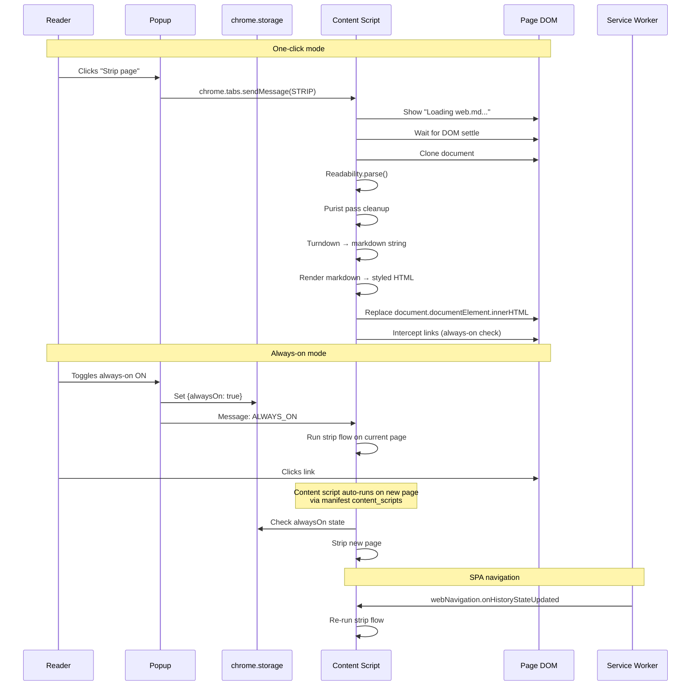

# web/md Chrome Extension

## Summary

Build a Chrome Manifest V3 extension that replaces web pages with pure semantic markdown. Readability extracts main content, Turndown converts to markdown, a purist pass strips residual noise, and the result renders as styled HTML in a full-page replacement. Two modes: one-click strip and always-on toggle that keeps every link in markdown mode. DOM-settle extraction via MutationObserver with 8s max wait handles SPAs.

---

## Problem Frame

The modern web buries content under styling, ads, trackers, and visual noise. web/md makes the bot-perspective visible — you browse the web and see only content. It's an art project that doubles as a functional tool for anyone who wants just the words. (See origin for full problem narrative.)

---

## Requirements

- R1. Use Readability as the primary content extraction engine (see origin R1)
- R2. Apply a purist pass after Readability to strip remaining non-semantic elements (see origin R2)
- R3. Output only semantic markdown — headings, paragraphs, links, lists, code blocks, blockquotes (see origin R3)
- R4. Replace entire page content with rendered markdown when activated (see origin R4)
- R5. Show pulsing "Loading web.md..." loader during extraction, 8s max wait (see origin R5)
- R6. Always-on mode keeps all navigations in markdown until toggled off (see origin R6)
- R7. Thin/no content pages show honest output, never block navigation (see origin R7)
- R8. Two controls: one-click strip and always-on toggle (see origin R8)
- R9. Toggle-off restores the original page via reload (see origin R9)

**Origin actors:** A1 (Reader)
**Origin flows:** F1 (One-click strip), F2 (Always-on mode), F3 (SPA/slow page)
**Origin acceptance examples:** AE1 (purist pass), AE2 (SPA thin content), AE3 (cross-site always-on), AE4 (full page replacement), AE5 (toggle-off restore)

---

## Scope Boundaries

- No Firefox or Safari support — Chrome first
- No file download/export — in-browser experience only
- No metadata extraction (author, date, reading time, word count)
- No image handling — images stripped entirely, not converted to alt text
- No API interception or JSON reconstruction — extraction is DOM-based only
- No offline mode or caching of markdown output

---

## Context & Research

### Relevant Code and Patterns

- Greenfield project — no existing codebase to follow
- Chrome Manifest V3 extension architecture: content scripts (isolated world, full DOM access), service worker (background, no DOM), popup (UI, full extension APIs)
- Content scripts communicate with service worker via `chrome.runtime.sendMessage` / `chrome.runtime.onMessage`
- State persistence via `chrome.storage.local`

### External References

- Mozilla Readability: `@mozilla/readability` — works directly in content scripts with real DOM, no JSDOM needed
- Turndown: `turndown` v7.2+ — browser-native HTML-to-markdown converter, accepts DOM nodes or HTML strings, extensible rule system for purist pass
- Chrome Manifest V3 docs: declarative content scripts with `"<all_urls>"` for always-on, `chrome.scripting.executeScript` for one-click
- `chrome.webNavigation.onHistoryStateUpdated` for SPA navigation detection

---

## Key Technical Decisions

- **Declarative content scripts + storage check for always-on**: Content script runs on every page via manifest declaration, checks `chrome.storage.local` for always-on state, exits early if off. More reliable than dynamic registration which depends on service worker being awake. (Trade-off: triggers Chrome's "read and change all data" permission warning.)
- **`document.documentElement.innerHTML` replacement**: Replaces entire page content while preserving extension context (messaging, storage access). Does NOT break `chrome.runtime` like `document.open/write/close` would.
- **Page reload for toggle-off**: Simplest and most reliable way to restore original page. No need to store original DOM.
- **Rendered markdown via Turndown + styled HTML**: Turndown converts Readability output to markdown string, then a lightweight renderer converts markdown to styled HTML for display. Good typography, comfortable reading, with the markdown aesthetic (monospace headings, visible link URLs).
- **MutationObserver + 500ms debounce + 8000ms hard timeout**: Research-validated pattern for DOM-settle detection. 500ms stability threshold (no mutations = settled), 8000ms hard cap per requirements.

---

## Open Questions

### Resolved During Planning

- **Purist pass targets**: After Readability, the purist pass removes: `<nav>`, `<footer>`, `<aside>` (not already removed by Readability), elements with common promotional/share/cookie-banner class patterns, ``, `<figure>`, `<figcaption>`, social sharing widgets, cookie consent banners, related/recommended article sections.
- **Markdown rendering**: Rendered markdown as styled HTML — headings rendered as headings, paragraphs as paragraphs, links styled and clickable. Not raw markdown syntax.
- **DOM-settle heuristic**: MutationObserver with 500ms debounce + 8000ms hard timeout.
- **Navigation interception**: Declarative content scripts matching `<all_urls>` with `chrome.storage.local` state check. Service worker uses `chrome.webNavigation.onHistoryStateUpdated` to message content script on SPA navigations. `pageshow` event for BFCache restoration.

### Deferred to Implementation

- **Exact purist pass class/id patterns**: The specific CSS class names and ID patterns for promotional content, cookie banners, and social widgets will be discovered during implementation by testing against real websites. Maintain a configurable blocklist.
- **Markdown rendering library**: Whether to use a lightweight markdown-to-HTML renderer (marked, markdown-it) or write a minimal custom renderer. Decision depends on bundle size and custom styling needs — implementation will evaluate.
- **Typographic style details**: Fonts, spacing, colors, and link styling for the rendered markdown output. This is an artistic choice that should be iterated on visually during implementation.

---

## Output Structure

```
webmd/
├── manifest.json
├── src/
│   ├── background.js          # Service worker
│   ├── content.js              # Content script (main entry)
│   ├── popup/
│   │   ├── popup.html          # Extension popup UI
│   │   └── popup.js            # Popup logic
│   ├── extraction/
│   │   ├── readability-loader.js   # Readability init wrapper
│   │   ├── purist-pass.js          # Post-Readability cleanup rules
│   │   └── settle-detector.js      # MutationObserver + debounce + timeout
│   ├── rendering/
│   │   └── markdown-renderer.js     # Markdown string → styled HTML
│   └── styles/
│       └── webmd.css               # Page replacement styles
├── icons/
│   ├── icon16.png
│   ├── icon48.png
│   └── icon128.png
├── package.json
└── vite.config.js              # Or similar bundler config
```

---

## High-Level Technical Design

> *This illustrates the intended approach and is directional guidance for review, not implementation specification.*



---

## Implementation Units

### U1. Extension scaffolding and manifest

**Goal:** Set up the Chrome Manifest V3 extension project with build tooling, manifest.json, and a working popup that can communicate with a content script.

**Requirements:** R8

**Dependencies:** None

**Files:**
- Create: `manifest.json`
- Create: `package.json`
- Create: `vite.config.js` (or chosen bundler)
- Create: `src/background.js`
- Create: `src/popup/popup.html`
- Create: `src/popup/popup.js`
- Create: `src/content.js` (skeleton)
- Create: `icons/icon16.png`, `icons/icon48.png`, `icons/icon128.png`

**Approach:**
- Configure manifest.json with Manifest V3, `"<all_urls>"` host permissions, `storage`, `scripting`, `activeTab`, `webNavigation` permissions
- Set up content script declaration in manifest matching `<all_urls>` at `document_idle`
- Create minimal popup HTML with toggle for always-on mode and one-click strip button
- Set up bundler (esbuild or Vite) to bundle content script with Readability and Turndown dependencies
- Implement `chrome.storage.local` read/write for always-on toggle state
- Wire up content script skeleton that listens for messages from popup and service worker
- Create background service worker skeleton with `webNavigation.onHistoryStateUpdated` listener

**Test scenarios:**
- Happy path: Extension loads in Chrome without errors, popup opens and displays UI
- Happy path: Popup toggle writes `alwaysOn: true` / `false` to `chrome.storage.local`
- Integration: Popup sends message to content script and receives acknowledgment
- Edge case: Content script exits early when always-on is false and no one-click message received

**Verification:**
- Extension installs and loads in Chrome without console errors
- Popup UI renders and toggles persists state across popup open/close cycles
- Content script loads on every page (verified via console log) but exits early when always-on is off

---

### U2. Content extraction pipeline

**Goal:** Implement the Readability → purist pass → Turndown pipeline that extracts semantic content from a page DOM and produces a clean markdown string.

**Requirements:** R1, R2, R3, R7

**Dependencies:** U1

**Files:**
- Create: `src/extraction/readability-loader.js`
- Create: `src/extraction/purist-pass.js`
- Create: `src/extraction/settle-detector.js`
- Create: `src/content.js` (extraction integration)
- Test: `tests/extraction/purist-pass.test.js`
- Test: `tests/extraction/settle-detector.test.js`

**Approach:**
- `readability-loader.js`: Clone document (`document.cloneNode(true)`), run `isProbablyReaderable()` check first, then `new Readability(clone).parse()`. Return `null` for non-readable pages (SPAs with thin content) — this handles R7.
- `purist-pass.js`: Takes Turndown instance and adds removal/filter rules. Removes: ``, `<figure>`, `<figcaption>`, `<nav>`, `<footer>`, `<aside>`, cookie banners (common class patterns), social sharing widgets, related/recommended sections. Configurable rules list so new patterns can be added without code changes.
- `settle-detector.js`: MutationObserver with 500ms debounce timer + 8000ms hard timeout. Filters out attribute-only mutations on animation elements. Returns a promise that resolves with `{settled: boolean, mutationCount: number, timedOut: boolean}`.
- Integrate all three in content script: wait for DOM settle → check readability → parse → purist pass → convert to markdown string

**Test scenarios:**
- Happy path: Given a well-structured article page, extraction returns a markdown string containing headings, paragraphs, and links with no images, nav, or footer content. Covers AE1 (purist pass strips cookie banners and related stories sections).
- Edge case: Given a page where `isProbablyReaderable()` returns false, extraction returns `null` — content script shows thin content message. Covers AE2.
- Edge case: Given a page that continuously mutates DOM (live chat), settle-detector times out at 8s and resolves with what's available.
- Happy path: Purist pass removes social sharing widgets (identified by common class patterns like `share`, `social`, `sharing`).
- Edge case: Given a page with only navigation links and no article content, extraction returns the navigation text as-is (honest thin output).

**Verification:**
- On a sample article page (e.g., a blog post), extraction produces clean markdown with only semantic content
- On a known SPA (e.g., Gmail inbox), extraction returns thin but non-null content
- Settle detector returns within 8 seconds on all page types

---

### U3. Page replacement and rendering

**Goal:** Replace the page DOM with styled rendered markdown, showing a "Loading web.md..." pulsing loader during extraction.

**Requirements:** R4, R5, R7

**Dependencies:** U2

**Files:**
- Create: `src/rendering/markdown-renderer.js`
- Create: `src/styles/webmd.css`
- Modify: `src/content.js` (rendering integration)

**Approach:**
- `markdown-renderer.js`: Takes markdown string, converts to styled HTML using a lightweight renderer (marked or markdown-it). Wraps in a full-page container with web/md styling.
- `webmd.css`: Clean, readable typography — Georgia/serif for body, system sans-serif for headings, monospace for code, comfortable line-height and max-width. Links remain clickable and clearly styled. The aesthetic should feel like discovering a calmer web.
- Loader: Before extraction, replace `document.documentElement.innerHTML` with a minimal HTML page containing a pulsing "Loading web.md..." centered on a blank background. CSS animation for the pulse.
- After extraction completes, replace `document.documentElement.innerHTML` again with the rendered markdown page plus `webmd.css` styles injected inline.
- For thin/empty content (Readability returns null or very short content), show a minimal message with the page URL instead of broken output. Covers AE2 and R7.
- Blade the rendered page's `<title>` as `[original title] — web/md`

**Execution note:** The typography and visual style of the rendered output is the artistic core of this extension. Expect to iterate on CSS values visually.

**Test scenarios:**
- Happy path: Given extraction output, rendering produces a full-page replacement with styled headings, paragraphs, and links. Covers AE4.
- Happy path: Loader appears immediately when strip is triggered, pulses visibly, and disappears when content renders. Covers R5.
- Edge case: Given null extraction result (non-readable page), rendering shows a minimal message with the page URL rather than a blank page. Covers R7.
- Integration: After full replacement, all original page stylesheets and scripts are gone — no visual contamination from the original page.

**Verification:**
- On a news article page, the rendered output shows clean typography with no original page styling
- The pulsing loader is visible during extraction on slow-loading pages
- Links in rendered markdown are clickable

---

### U4. Always-on mode and navigation handling

**Goal:** Implement always-on mode so every page load and navigation triggers the strip flow, including SPA navigations.

**Requirements:** R6, R7

**Dependencies:** U3

**Files:**
- Modify: `src/background.js` (webNavigation listener)
- Modify: `src/content.js` (always-on check, SPA handling, pageshow)
- Modify: `src/popup/popup.js` (always-on toggle)

**Approach:**
- Content script entry point checks `chrome.storage.local` for `alwaysOn` state on every page load. If true, immediately runs the strip flow. If false, exits early (waits for one-click message).
- Service worker (`background.js`) listens to `chrome.webNavigation.onHistoryStateUpdated` and `chrome.webNavigation.onReferenceFragmentUpdated` for SPA navigations. Sends message to the relevant tab's content script to re-run the strip flow.
- Content script listens for `chrome.runtime.onMessage` with message types: `STRIP` (one-click), `ALWAYS_ON` (toggle on), `ALWAYS_OFF` (toggle off), `NAVIGATION` (SPA nav).
- On `ALWAYS_OFF`, reload the page (`window.location.reload()`) to restore original. Covers AE5 and R9.
- `pageshow` event listener for BFCache restoration — if `event.persisted` is true and always-on is active, re-run strip flow.
- When the strip flow runs in always-on mode, all links in the rendered markdown are normal `<a>` tags with `href` attributes. Clicking them triggers a standard navigation, and the content script on the new page auto-runs because of the manifest's declarative content script. No special link interception needed — the architecture handles it naturally. Covers AE3 and R6.

**Test scenarios:**
- Happy path: Toggle always-on ON, navigate to an article, see markdown. Click a link, new page also renders as markdown. Covers AE3.
- Happy path: With always-on ON, click an external link (different domain), new page renders as markdown. Cross-domain works. Covers AE3.
- Integration: Navigate to a SPA (e.g., Twitter), trigger a `pushState` navigation, content script re-runs and re-renders the new "page."
- Edge case: With always-on ON, use browser back button. Previous page re-renders as markdown (BFCache handling via pageshow event).
- Happy path: Toggle always-on OFF. Page reloads and shows original content. Covers AE5.
- Edge case: With always-on OFF, content script exits early and does not transform the page.

**Verification:**
- Always-on mode persists across page navigations and browser restarts
- SPA navigations trigger re-extraction and re-rendering
- Toggle-off restores original page via reload
- Back/forward navigation works in always-on mode

---

### U5. Popup UI and toggle controls

**Goal:** Build the extension popup UI with one-click strip button and always-on toggle, with clear visual feedback for the current state.

**Requirements:** R8, R9

**Dependencies:** U4

**Files:**
- Modify: `src/popup/popup.html`
- Modify: `src/popup/popup.js`
- Create: `src/styles/popup.css`

**Approach:**
- Popup shows two controls: a "Strip this page" button (one-click) and an "Always on" toggle switch.
- On open, popup reads `chrome.storage.local` for current always-on state and displays it.
- "Strip this page" sends a `STRIP` message to the active tab's content script via `chrome.tabs.sendMessage`.
- Always-on toggle writes to `chrome.storage.local` and sends a message to the active tab. If toggling OFF, sends `ALWAYS_OFF` which triggers a page reload.
- Minimal, clean popup design that matches the web/md aesthetic — monospace, simple, no chrome.
- Popup also shows the current page's strip status (active/inactive) if possible.

**Test scenarios:**
- Happy path: Clicking "Strip this page" transforms the current tab into markdown view. Covers AE4, R8.
- Happy path: Toggling "Always on" ON persists across popup open/close cycles. Covers R8.
- Integration: Toggling "Always on" OFF reloads the page to original. Covers AE5, R9.
- Edge case: Popup opens on a chrome:// or file:// page where content scripts can't run — shows a "not available" message.

**Verification:**
- Popup UI renders correctly in Chrome extension popup
- One-click strip works on the current tab
- Always-on toggle persists state and activates/deactivates transformation across pages
- Toggle-off reloads page to original content

---

## System-Wide Impact

- **Interaction graph:** Popup → content script (messages), service worker → content script (webNavigation messages), content script → chrome.storage (state reads)
- **Error propagation:** Non-readable pages produce a thin-content message rather than an error screen. Extension messaging failures should be caught and logged silently — the extension should degrade gracefully.
- **State lifecycle risks:** Always-on state persisted in `chrome.storage.local` must be checked on every content script load. If storage read fails (rare), default to OFF (safe default — don't transform pages accidentally).
- **Integration coverage:** Cross-origin navigation in always-on mode depends on content scripts auto-loading on every page — verified by the manifest's `<all_urls>` match pattern.

---

## Risks & Dependencies

| Risk | Mitigation |
|------|------------|
| `<all_urls>` permission triggers Chrome's "read all data" warning, reducing installs | Accepted for v1. Consider `activeTab`-only mode as a future option for users who don't want always-on. |
| Readability produces poor results on some sites (forums, docs, SPAs) | Accepted — thin/empty output is honest behavior per R7. Not a bug. |
| SPA navigations may not always trigger `webNavigation` events | Content script also listens for `pageshow` and can fall back to periodic re-check. |
| Purist pass class patterns need ongoing maintenance as sites evolve | Configurable rules list allows easy additions without core logic changes. |
| Bundle size (Readability + Turndown + renderer) may be large | Monitor bundle size; both libraries are ~30KB each minified — acceptable for an extension. |

---

## Sources & References

- **Origin document:** [webmd-requirements.md](.opencode/plans/webmd-requirements.md)
- External docs: [Chrome Manifest V3 docs](https://developer.chrome.com/docs/extensions/mv3/), [Mozilla Readability](https://github.com/mozilla/readability), [Turndown](https://github.com/mixmark-io/turndown)